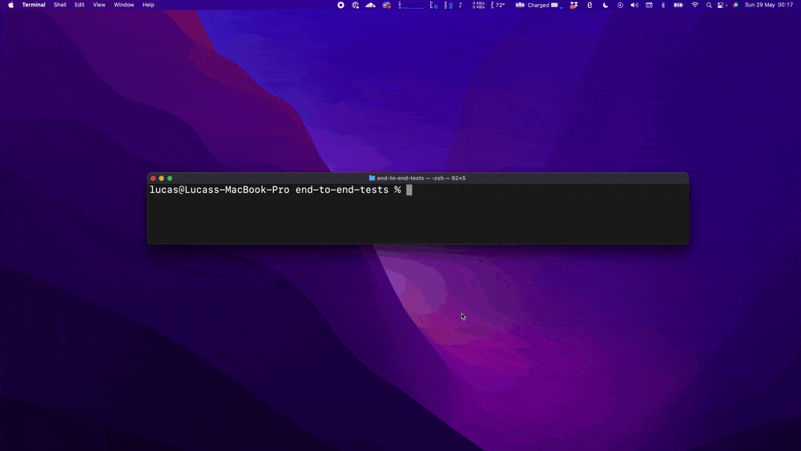

# (CODE EXAMPLES) The Four Major Categories of Software Testing
Read the article at [here](https://lucaspaganini.com)

## Static Tests
1. Inside the static-tests directory, execute the following command: `npm clean-install`

## Unit Tests
1. Inside the unit-tests directory, execute the following command: `npm clean-install`
2. Then, to run the tests, execute: `npm test`

## Integration tests 
1. Inside the unit-tests directory, execute the following command: `npm clean-install`
2. Then, to run the tests, execute: `npm test`

## End to End Tests
1. Inside the end-to-end-tests directory, execute the following command: `npm clean-install`
2. To run the server, run: `npm start`
3. Then, to run the Cypress tests, execute: `npx cypress open`
4. This will open a Cypress window, click on the `fruits.spec.ts` file to run the tests

